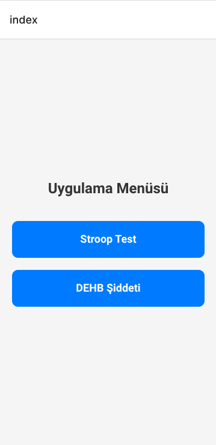
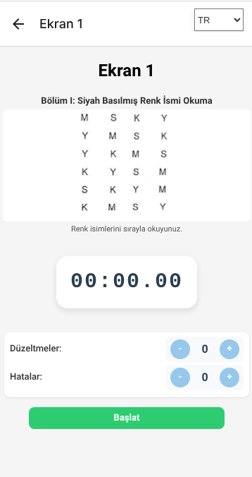
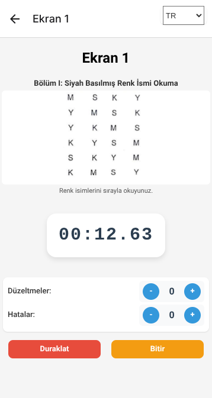

# Stroop Test Uygulaması

Bu proje, Stroop Testi ve DEHB (Dikkat Eksikliği ve Hiperaktivite Bozukluğu) şiddetini ölçmeye yönelik modern ve kullanıcı dostu bir mobil/web uygulamasıdır.

## Özellikler

- **Stroop Testi**: Kullanıcıya renk isimlerini ve renkli kelimeleri hızlı ve doğru şekilde okuma görevi verir.
- **DEHB Şiddeti Ölçümü**: Kullanıcıdan alınan verilere göre DEHB şiddetini değerlendiren bir modül içerir.
- **Çoklu Dil Desteği**: Türkçe ve İngilizce başta olmak üzere çoklu dil desteği.
- **Zamanlayıcı ve Hata Takibi**: Test sırasında süreyi ve yapılan hataları kolayca takip edebilirsiniz.
- **Modern ve Basit Arayüz**: Kullanıcı dostu, sade ve anlaşılır bir tasarım.

---

## Ekran Görüntüleri

### Ana Menü



> Uygulama açıldığında kullanıcıyı karşılayan ana menü. Buradan Stroop Testi veya DEHB Şiddeti modüllerine geçiş yapılabilir.

---

### Stroop Testi - Başlangıç



> Test başlamadan önce kullanıcıya yönergeler ve test içeriği sunulur. Dil seçimi yapılabilir.

---

### Stroop Testi - Zamanlayıcı Aktif



> Test sırasında zamanlayıcı çalışır, kullanıcı hatalarını ve düzeltmelerini kolayca kaydedebilir. Testi duraklatma veya bitirme seçenekleri mevcuttur.

---

## Kurulum

1. **Depoyu klonlayın:**
   ```bash
   git clone https://github.com/kullanici/stroop.git
   cd stroop
   ```

2. **Bağımlılıkları yükleyin:**
   ```bash
   npm install
   ```

3. **Projeyi başlatın:**
   ```bash
   npm start
   ```

---

## Kullanılan Teknolojiler

- React / React Native
- TypeScript
- Expo
- Context API (Çoklu dil ve tema yönetimi)
- Modern UI/UX tasarımı

---

## Katkıda Bulunmak

Katkılarınızı memnuniyetle karşılıyoruz! Lütfen bir pull request açmadan önce bir issue oluşturun.

---

## Lisans

Bu proje MIT lisansı ile lisanslanmıştır.

---